<div align="center">
  

  <br />

  [](https://shruhathreddy.in)
  [](https://www.linkedin.com/in/shruhath-reddy/)
  [](mailto:shruhathkreddy@gmail.com)
</div>

## Hey, I'm Shruhath 👋

I build software where **systems engineering, AI, and product thinking** meet. My favorite work starts as a difficult technical problem and ends as something real people can rely on - from encrypted peer-to-peer compute to university platforms used at scale.

```go
type Shruhath struct {
    Building   []string // distributed systems, AI pipelines, production web apps
    WorkingAt  string   // Museigen Tech - SDE Intern
    LeadingAt  string   // iDEA, Amrita - Tech Head
    LearningAt string   // Amrita Vishwa Vidyapeetham - CSE '28
    Principle  string   // make it useful, make it reliable, then make it elegant
}
```

### Right now

- 🧠 Integrating **LLM pipelines** with production software at **Museigen Tech**.
- 🌐 Building **NodeShare**, a Go-based distributed compute tool over encrypted libp2p tunnels.
- 🚀 Leading the technical roadmap and codebase for **iDEA**, Amrita's innovation and entrepreneurship platform.
- 🛠️ Delivering end-to-end products for enterprise clients through **Ushodaya Networks**.

## Proof of work

<div align="center">

| **10,000+** | **1,500+** | **4,000+ / day** | **Multi-client** |
|:---:|:---:|:---:|:---:|
| Techfest participants served | University platform users | Database operations handled | Production apps delivered |

</div>

## Selected builds

| Project | Engineering story | Core stack |
|---|---|---|
| **NodeShare** | P2P distributed compute across encrypted tunnels, with live Docker output, NAT traversal, relay, and hole punching. Built with a small team at iDEA. | Go · go-libp2p · Protobuf · Docker · QUIC |
| **[DutyON](https://github.com/Shruhath/on-duty-amrita)** | Role-based university leave and attendance workflows with NFC support, real-time data, and operational exports. | Next.js · TypeScript · Firebase · NFC |
| **[Tamil NLP Glossary](https://github.com/Shruhath/slm-glossary-tamil)** | A 615M-parameter language model translating an English NLP glossary into Tamil entirely on local hardware. | Python · NLLB-200 · PyTorch · ReportLab |
| **Screen9** | Hyperlocal journalism platform and CMS that lets citizen reporters publish community news. | React · Node.js · Supabase · CMS |
| **[Vote CastED](https://github.com/Shruhath/Vote-CastED)** | Secure university election management with verified voters, live results, and an admin control plane. | React · TypeScript · Firebase · OAuth |

<div align="center">
  <a href="https://github.com/Shruhath?tab=repositories"><strong>Explore all repositories →</strong></a>
</div>

## Engineering toolkit

<div align="center">

<p><strong>Languages</strong></p>


<p><strong>Backend &amp; systems</strong></p>


<p><strong>Frontend, cloud &amp; quality</strong></p>


</div>

## Journey so far

```text
2026 - now   SDE Intern, Museigen Tech          software x AI engineering
2026 - now   Tech Head, iDEA                    technical leadership
2025 - now   Founder, Ushodaya Networks         client products, end to end
2025 - now   Backend & database roles           Init Club / ELITE Club
2025 - 2026  Frontend Developer, Anokha         interfaces for 10K+ participants
2024 - 2028  B.Tech CSE, Amrita                 engineering the fundamentals
```

<details>
<summary><strong>A few wins I'm proud of</strong></summary>

<br />

- Received a **Special Mention at DevX Hackathon** for *System Override*.
- Built Amrita's university events system, used by **1,500+ students** and handling **4,000+ daily database reads and writes**.
- Helped ship the frontend for **Anokha**, serving **10,000+ participants** across India.
- Grew from developer to **Tech Head at iDEA**, owning technical development and codebase quality.

</details>

## GitHub pulse

<div align="center">
  
</div>

## Let's build something that matters

I'm most interested in **backend systems, developer infrastructure, distributed computing, and applied AI**. If you're working on a hard problem with real users, I'd love to hear about it.

<div align="center">

[](mailto:shruhathkreddy@gmail.com)

<sub>Built with curiosity, caffeine, and a healthy dislike of "works on my machine."</sub>

</div>
